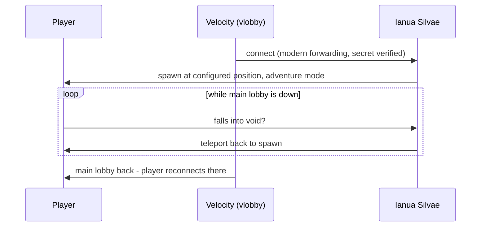

Ianua Silvae is a standalone Minecraft server built on [Minestom](https://minestom.net/), not a plugin for Bukkit/Paper. Minestom provides the protocol and a minimal server core, and leaves world storage, game rules, and behavior entirely to the application — which is exactly what a fallback lobby needs.

## Why Minestom

A fallback lobby must be more reliable than the servers it backs up. Running a second PaperMC instance would mean a second copy of the same failure modes: heavy startup, chunk IO, plugin updates. Minestom removes almost all of it:

- No vanilla world loading or chunk persistence
- No plugin ecosystem — the entire behavior is this one codebase
- Startup measured in seconds, memory in megabytes

The trade-off — implementing every behavior yourself — is small here, because a holding lobby needs almost no behavior.

## Schematic as world

There is no world folder. At startup the server:

1. Creates a **void instance** (an empty Minestom `InstanceContainer` with no chunk generator).
2. Loads the schematic from `schematicPath` (Sponge schematic format, e.g. exported with WorldEdit).
3. Pastes the schematic into the instance at the configured origin.

The pasted blocks are the entire world. Everything outside the schematic is void. This makes the world **immutable by construction**: it is rebuilt identically from the schematic on every start, so there is nothing to back up and no way for state to rot.

## Player lifecycle

- **Join**: players spawn at the configured `spawn` position in **adventure gamemode**, so they cannot break or place blocks.
- **Void safety**: a movement check teleports any player whose Y coordinate drops below the world back to spawn, instead of letting them fall forever or take void damage.
- **Leave**: recovery is vlobby's job — when a real lobby is reachable again, new connections go there, and players on the fallback can reconnect or be moved by the proxy.

## Velocity modern forwarding

The server only accepts connections carrying a valid modern-forwarding payload signed with the shared secret (`velocitySecret` / `IANUA_VELOCITY_SECRET`). This gives the fallback the real player UUIDs and skins, and prevents anyone from bypassing the proxy by connecting directly.

## Code layout

The implementation lives under the package root `party.morino.ianuasilvae`, in a single Gradle module (Kotlin DSL, version catalog in `gradle/libs.versions.toml`, ktlint-formatted — the same conventions as the other morinoparty projects). Configuration is a kotlinx-serialization JSON data class with environment-variable overrides applied on top; see [Configuration](/docs/configuration).
