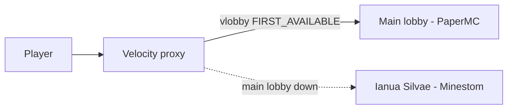

*Ianua Silvae* (Latin: "gate of the forest") is a lightweight **fallback lobby server** for the [morino.party](https://morino.party) Minecraft network.

The main lobby of morino.party runs on PaperMC. When it goes down, the Velocity proxy plugin **vlobby** — configured with its `FIRST_AVAILABLE` strategy — routes players to Ianua Silvae as the last-resort lobby. Instead of being kicked from the network, players land in a small holding lobby until a real lobby comes back.

## Design goals

- **Stay up.** Built on [Minestom](https://minestom.net/), a standalone Minecraft server library, with no plugin ecosystem or vanilla world machinery to fail.
- **Start fast, idle cheap.** There is no world folder: a void instance is created at startup and a schematic (`lobby.schem`) is pasted into it. The server boots in seconds and idles on minimal memory.
- **Be safe by default.** Players join in adventure gamemode and are teleported back to spawn if they fall into the void. There is nothing to grief and nothing to break.
- **Fit the network.** Velocity modern forwarding is supported out of the box, with the forwarding secret supplied via config file or environment variable.

## How it fits into the network

vlobby tries each lobby in its configured order and connects the player to the first one that is reachable. Ianua Silvae is registered **last**, so it only ever receives players when every real lobby is unavailable.

## Where to go next

<Cards>
	<Card title="Getting Started" href="/docs/getting-started" description="Build the server and run it with your own schematic." />
	<Card title="Configuration" href="/docs/configuration" description="All config.json fields and their environment-variable overrides." />
	<Card title="Deployment" href="/docs/deployment" description="Run behind Velocity and vlobby, with a systemd unit example." />
	<Card title="Architecture" href="/docs/architecture" description="How the Minestom instance and schematic-as-world design work." />
</Cards>
